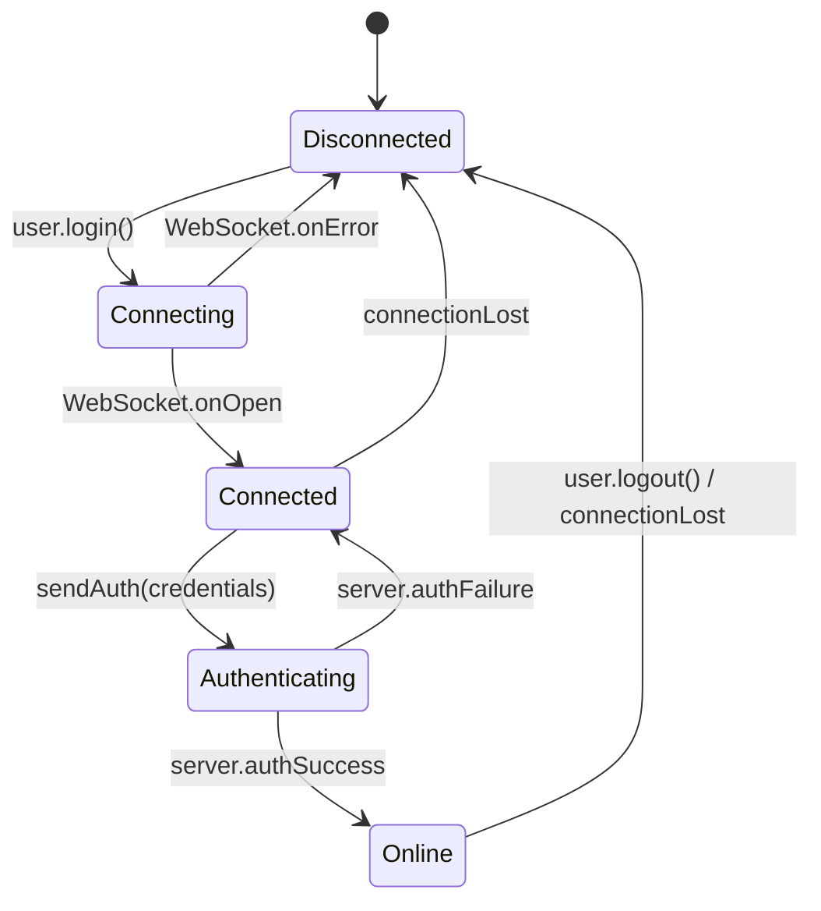
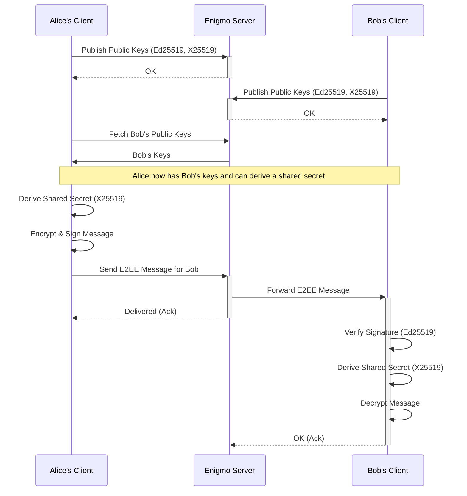

# Enigmo — Secure, Private, Real‑Time Messaging

Enigmo is a privacy‑first, end‑to‑end encrypted messaging platform designed for modern mobile and edge environments. The system is split into a Flutter client and a lightweight Dart server that exposes a minimal REST surface and a real‑time WebSocket for message delivery.

- Monorepo structure:
  - `enigmo_app/` — Flutter client (iOS/Android) with client‑side cryptographic identity and E2E encryption
  - `enigmo_server/` — Dart server for auth/bootstrap, routing, presence, and observability
- Creator: Emil Rokossovskiy — https://github.com/rokoss21/emigmo

---

## Highlights
- Strong cryptography by default — Ed25519 identities, X25519 ECDH key agreement, AEAD encryption
- Real‑time messaging over WebSocket, minimal REST for health/stats
- Clean architecture, test coverage for crypto, user, and integration flows
- Mobile‑first: fast startup, low memory footprint, predictable UX

---

## Architecture Overview

- Client (`enigmo_app/`):
  - Generates and stores long‑term identity (Ed25519) on device
  - Derives X25519 for ECDH session key agreement
  - Encrypts messages using AEAD (nonce + MAC) and signs payloads
  - Communicates with server via REST (health) and WebSocket (`/ws`)

- Server (`enigmo_server/`):
  - Maintains user directory and session/presence
  - Routes encrypted payloads without access to plaintext
  - Provides health (`/api/health`) and stats (`/api/stats`)
  - Stateless routing by design; persistence can be added via adapters

- Protocol (high‑level):
  - One‑time bootstrap: publish public keys, fetch contacts’ public keys
  - For each peer session: derive shared secret via X25519, produce AEAD key
  - All messages are encrypted client‑side and signed; the server never sees plaintext

```mermaid
graph TD
    subgraph Enigmo Flutter App (Client)
        A[UI/UX Layer]
        B[Services Layer]
        C[Crypto Engine]
        D[Secure Storage]
    end

    subgraph Enigmo Dart Server
        E[WebSocket Handler]
        F[User Manager]
        G[Message Router]
        H[REST API]
    end

    A --> B
    B --> C
    C --> D

    B -- WebSocket (E2EE Payload) --> E
    B -- REST (HTTPS) --> H

    E --> F
    E --> G

    style C fill:#f9f,stroke:#333,stroke-width:2px
    style G fill:#ccf,stroke:#333,stroke-width:2px
```

### Client State Lifecycle

The client application manages its connection to the WebSocket server through a simple state machine to ensure robust real-time communication.



---

## Security Model

- Identities: Ed25519 keypair per user; public keys may be pinned/verified out‑of‑band
- Key agreement: X25519 ECDH → symmetric AEAD key
- Encryption: SecretBox‑style AEAD (nonce + ciphertext + MAC)
- Authentication: Payloads are signed with Ed25519; server validates structural integrity but does not decrypt
- Replay mitigation: Nonce uniqueness per session; optional server monotonic counters
- Forward secrecy (roadmap): Double‑ratchet w/ periodic key rotation

---

## Data Model (simplified)

Client model `EncryptedMessage` (see `enigmo_app/lib/services/crypto_engine.dart`):
```dart
class EncryptedMessage {
  final String encryptedData; // base64(cipherText)
  final String nonce;         // base64(nonce)
  final String mac;           // base64(auth tag)
  final String signature;     // base64(Ed25519 over cipherText)
}
```

Server routes (see `enigmo_server/bin/anongram_server.dart`):
- `GET /api/health` — server status
- `GET /api/stats` — server, user, message counters
- `GET /ws` — WebSocket for real‑time messaging

---

## Cryptographic Flow

This diagram illustrates the end-to-end encrypted message exchange between two clients, Alice and Bob, mediated by the Enigmo server.



### Detailed Pseudocode

Here is a more granular breakdown of the cryptographic operations.

**1. Key Agreement (ECDH)**

Executed once per peer session to establish a symmetric encryption key.

```rust
// Alice wants to talk to Bob
// 1. Alice fetches Bob's public X25519 key from the server.
// 2. Alice uses her private X25519 key and Bob's public key.

function derive_shared_key(my_private_key: X25519_Priv, their_public_key: X25519_Pub) -> [u8; 32] {
    // Perform Elliptic Curve Diffie-Hellman
    let shared_secret = X25519(my_private_key, their_public_key);

    // Use a Key Derivation Function (e.g., HKDF-SHA256) for cryptographic hygiene
    // The context string prevents key reuse across different domains (e.g., attachments vs. messages).
    let context = "enigmo-e2ee-message-v1";
    let session_key = HKDF_SHA256(shared_secret, salt=null, info=context);
    return session_key;
}
```

**2. Sending a Message**

Alice encrypts and signs a message for Bob.

```javascript
// 1. Derive the key for this session
const sessionKey = derive_shared_key(alice.x25519_priv, bob.x25519_pub);

// 2. Prepare the message and associated data
const plaintext = "Hello, Bob!";
const associated_data = JSON.stringify({ sender: alice.id, timestamp: Date.now() });

// 3. Encrypt using an Authenticated Encryption with Associated Data (AEAD) cipher
const nonce = crypto.randomBytes(24); // Must be unique for each message with the same key
const { ciphertext, mac } = AEAD_Encrypt(sessionKey, nonce, plaintext, associated_data);

// 4. Sign the *ciphertext* with long-term identity key to prevent tampering
const signature = Ed25519_Sign(alice.ed25519_priv, ciphertext);

// 5. Construct the final payload for the server
const payload = {
  recipient: bob.id,
  message: {
    encryptedData: Base64.encode(ciphertext),
    nonce: Base64.encode(nonce),
    mac: Base64.encode(mac),
    signature: Base64.encode(signature)
  }
};

// 6. Send to server, which routes based on 'recipient'
websocket.send(JSON.stringify(payload));
```

**3. Receiving a Message**

Bob receives the payload from the server and decrypts it.

```javascript
// 1. Parse the incoming payload
const payload = JSON.parse(event.data);
const message = payload.message;
const senderId = payload.sender; // Server injects this

// 2. Fetch sender's public keys from local cache or server
const alice = get_user_keys(senderId);

// 3. Verify the signature on the ciphertext first
const is_valid_signature = Ed25519_Verify(
    alice.ed25519_pub,
    Base64.decode(message.encryptedData),
    Base64.decode(message.signature)
);
if (!is_valid_signature) { throw new Error("Invalid signature! Message tampered."); }

// 4. If signature is valid, derive the same session key
const sessionKey = derive_shared_key(bob.x25519_priv, alice.x25519_pub);

// 5. Decrypt the message
const associated_data = JSON.stringify({ sender: senderId, timestamp: payload.timestamp });
const plaintext = AEAD_Decrypt(
    sessionKey,
    Base64.decode(message.nonce),
    Base64.decode(message.encryptedData),
    Base64.decode(message.mac),
    associated_data
);

if (plaintext === null) { throw new Error("Decryption failed! MAC mismatch."); }

// 6. Render the plaintext message
console.log("New message:", plaintext);
```

**4. Server-Side Routing (Simplified)**

The server's role is to act as a secure routing fabric. It never decrypts message content.

```go
// High-level server logic for the WebSocket handler

// In-memory map to track active user connections
// In a production system, this would be backed by Redis or a similar store.
var active_connections = make(map[UserID]WebSocketConnection)

func WebSocketHandler(ws: WebSocketConnection) {
    // 1. Authenticate the connection
    // The client sends a token or public key to identify itself.
    user_id, err := Authenticate(ws)
    if err != nil {
        ws.Close("Authentication failed")
        return
    }

    // 2. Register the user's connection
    active_connections[user_id] = ws
    log.Printf("User %s connected", user_id)

    // 3. Enter the message routing loop
    for {
        message, err := ws.ReadMessage()
        if err != nil {
            // Connection closed or error
            delete(active_connections, user_id)
            log.Printf("User %s disconnected", user_id)
            break
        }

        // 4. Parse the outer envelope to find the recipient
        // The server only reads metadata, not the encrypted 'message' object.
        envelope, err := ParseEnvelope(message)
        if err != nil {
            ws.SendMessage("{"error": "Invalid envelope"}")
            continue
        }

        // 5. Look up the recipient's connection
        recipient_ws, found := active_connections[envelope.RecipientID]
        if !found {
            // Handle offline recipient (e.g., store for later delivery - see roadmap)
            ws.SendMessage("{"error": "Recipient offline"}")
            continue
        }

        // 6. Forward the *original, encrypted* message payload
        // The server injects the sender's ID for the recipient's convenience.
        forward_payload = AddSenderID(message, user_id)
        err = recipient_ws.SendMessage(forward_payload)
        if err != nil {
            log.Printf("Failed to forward message to %s", envelope.RecipientID)
        }
    }
}
```

---

## Local Development

Prerequisites:
- Flutter SDK (stable) and Dart SDK
- iOS/Android toolchains set up per Flutter docs

Setup both projects:
```bash
# Server
cd enigmo_server
dart pub get

# App
cd ../enigmo_app
flutter pub get
```

Run:
```bash
# Server (defaults host=localhost, port=8080)
cd enigmo_server
dart run bin/anongram_server.dart --host localhost --port 8080

# App (choose a connected device/emulator)
cd ../enigmo_app
flutter run
```

Test:
```bash
cd enigmo_server && dart test
cd ../enigmo_app && flutter test
```

Build:
```bash
# Android
cd enigmo_app && flutter build apk  # or: flutter build appbundle
# iOS
flutter build ios  # requires Xcode signing
```

---

## Project Structure
```
/               Root monorepo
├── enigmo_app/       Flutter client (models/, services/, screens/)
└── enigmo_server/    Dart server (bin/, lib/services/, lib/utils/, test/)
```

Key components:
- Client crypto: `enigmo_app/lib/services/crypto_engine.dart`
- Client networking: `enigmo_app/lib/services/network_service.dart`
- Server entrypoint: `enigmo_server/bin/anongram_server.dart`
- Server managers: `enigmo_server/lib/services/`

---

## Roadmap

Short‑term
- UX polish, accessibility, telemetry opt‑in
- Key pinning and trust‑on‑first‑use (TOFU)
- Offline outbox, retry/backoff, exponential jitter
- Message attachments with client‑side encryption

Medium‑term
- Forward secrecy: double‑ratchet, periodic key rotation
- Multi‑device support with per‑device keys
- Encrypted group messaging (sender keys)
- End‑to‑end encrypted backups and key recovery

Voice & Video (WebRTC)
- Signaling over existing WebSocket channel
- DTLS‑SRTP, ICE/TURN/STUN handling
- P2P preferred; SFU fallback
- Encrypted media recordings (opt‑in)

Enterprise
- Policy engine (DLP‑friendly on encrypted metadata only)
- Observability and metrics exporters (OpenTelemetry)
- Pluggable storage (PostgreSQL, S3) and queue (NATS, Kafka)

---

## Quality & Security
- Linting and formatting via `dart format` / `flutter format`
- Unit/integration tests in both projects
- Structured logs with `package:logging`
- Threat model documented inline; server stores only metadata needed for routing

---

## Contributing

Contributions are welcome. Please open an issue to discuss substantial changes. PRs should include tests and follow project formatting.

---

## License

TBD — Choose a license (e.g., Apache‑2.0, MIT). We recommend permissive licensing to encourage adoption.

---

## GitHub Readiness Checklist
- [x] Clear README with architecture, security, and roadmap
- [x] App/Server READMEs for quick start
- [ ] Choose a License and add `LICENSE`
- [ ] Set up CI (Flutter/Dart tests)
- [ ] Add badges (build, license)
- [ ] Create GitHub issues/milestones from Roadmap

—
Built with care by Emil Rokossovskiy.
