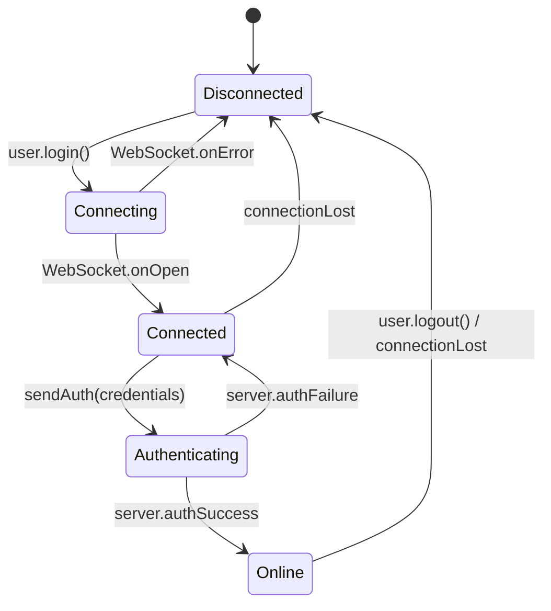
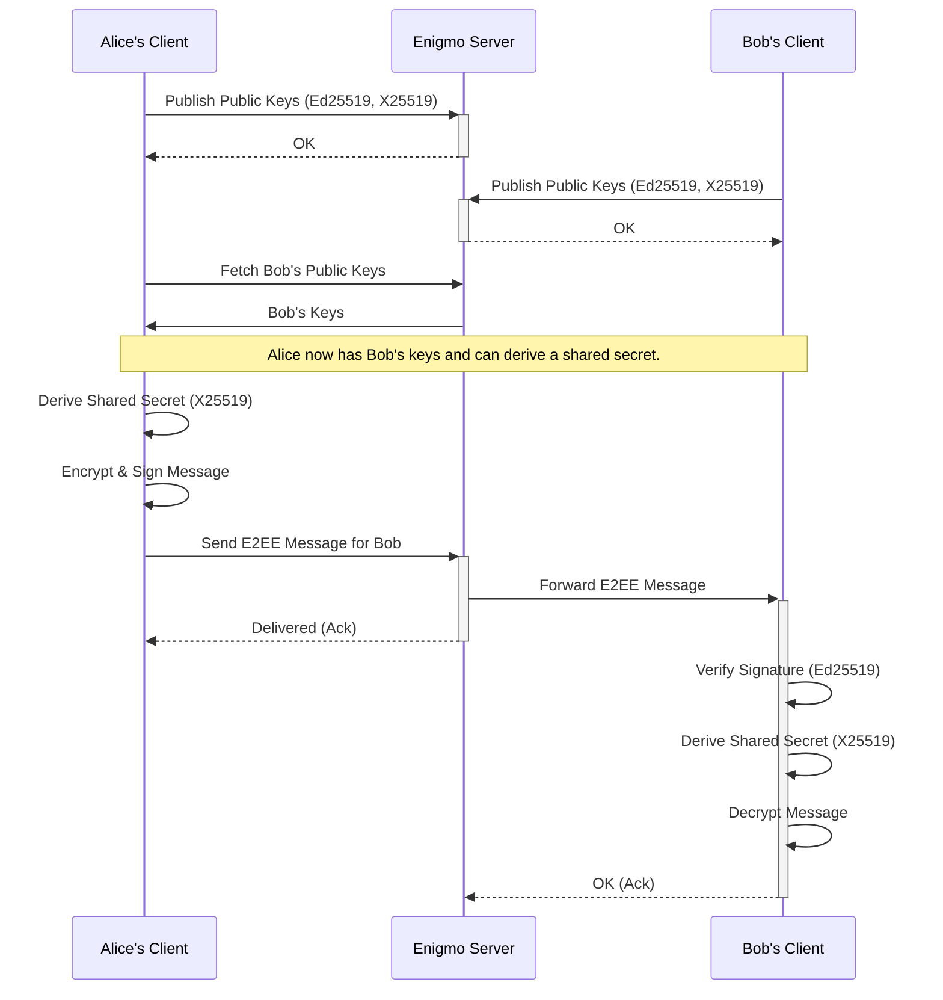

<div align="center">

# 🔐 Enigmo

**Enterprise-Grade Secure Messaging Platform**

*Privacy-first, end-to-end encrypted messaging designed for the modern world*

[](https://flutter.dev)
[](https://dart.dev)
[](LICENSE)
[](https://github.com/rokoss21/emigmo/actions)
[]()
[]()

[🚀 Quick Start](#quick-start) • [📖 Documentation](#architecture-overview) • [🔧 Development](#local-development) • [🛣️ Roadmap](#roadmap) • [🤝 Contributing](#contributing)

---

</div>

## 🌟 Key Features

<table>
<tr>
<td width="50%">

### 🔒 **Zero-Knowledge Security**
- **Ed25519** digital signatures for identity
- **X25519** ECDH for perfect forward secrecy
- **AEAD** encryption with authenticated data
- **Client-side** key generation and storage
- **Zero-trust** server architecture

</td>
<td width="50%">

### ⚡ **Real-Time Performance**
- **WebSocket** for instant messaging
- **Low-latency** message routing
- **Minimal** server footprint
- **Mobile-optimized** architecture
- **Battery-efficient** design

</td>
</tr>
<tr>
<td>

### 📱 **Cross-Platform Native**
- **Flutter** for iOS, Android, Web
- **Native performance** on all platforms
- **Consistent UI/UX** across devices
- **Offline-first** capabilities
- **Progressive Web App** support

</td>
<td>

### 🏗️ **Production-Ready**
- **Monorepo** structure for easy maintenance
- **Comprehensive** test coverage
- **Docker** containerization
- **Scalable** server architecture
- **Enterprise** deployment ready

</td>
</tr>
</table>

## 🏗️ Architecture Overview

<div align="center">

*Enigmo follows a zero-trust architecture where the server never has access to plaintext messages*

</div>

### 📦 **Monorepo Structure**

```
📁 enigmo/
├── 📱 enigmo_app/          # Flutter Mobile & Web Client
│   ├── lib/models/         # Data models and entities
│   ├── lib/services/       # Business logic & crypto engine
│   ├── lib/screens/        # UI screens and widgets
│   └── test/              # Comprehensive test suite
└── 🖥️ enigmo_server/       # Lightweight Dart Server
    ├── bin/               # Server entrypoint
    ├── lib/services/      # User management & routing
    └── test/             # Server-side tests
```

### 🔄 **Component Responsibilities**

<table>
<tr>
<th width="50%">📱 Client (Flutter App)</th>
<th width="50%">🖥️ Server (Dart Backend)</th>
</tr>
<tr>
<td>

- **🔑 Key Management**: Ed25519 identity generation
- **🔐 Encryption**: X25519 ECDH + AEAD encryption  
- **✍️ Signing**: Message authenticity with Ed25519
- **💾 Storage**: Secure local key storage
- **🌐 Communication**: WebSocket + REST API
- **🔄 State Management**: Real-time UI updates

</td>
<td>

- **👥 User Directory**: Public key management
- **📨 Message Routing**: Zero-knowledge forwarding
- **🔌 WebSocket Handling**: Real-time connections
- **📊 Health Monitoring**: `/api/health`, `/api/stats`
- **🔒 Session Management**: Connection state tracking
- **⚖️ Load Balancing**: Stateless horizontal scaling

</td>
</tr>
</table>

### 🔐 **Security Protocol Flow**

1. **🎯 Bootstrap**: Clients publish Ed25519/X25519 public keys
2. **🤝 Key Exchange**: X25519 ECDH derives shared session secrets
3. **📝 Message Encryption**: AEAD with nonce + MAC authentication
4. **✅ Digital Signing**: Ed25519 signature for message integrity
5. **📡 Zero-Knowledge Routing**: Server forwards without decryption

### 🏗️ **System Architecture Diagram**

<table>
<tr>
<td width="45%" align="center">

**📱 ENIGMO FLUTTER APP**

</td>
<td width="10%" align="center">

**🔄 COMMUNICATION**

</td>
<td width="45%" align="center">

**🖥️ ENIGMO DART SERVER**

</td>
</tr>
<tr>
<td valign="top">

```
┌─────────────────────────┐
│    🎨 UI/UX Layer       │
└─────────┬───────────────┘
          │
┌─────────▼───────────────┐
│   ⚙️ Services Layer     │
└─────────┬───────────────┘
          │
┌─────────▼───────────────┐
│   🔐 Crypto Engine      │ ← Core
└─────────┬───────────────┘
          │
┌─────────▼───────────────┐
│   💾 Secure Storage     │
└─────────────────────────┘
```

**Key Responsibilities:**
- 🔑 Key generation & management
- 🔐 Message encryption/decryption
- ✍️ Digital signature creation
- 💾 Secure local storage
- 🎨 Real-time UI updates

</td>
<td align="center" valign="middle">

**🔌 WebSocket**  
*(E2EE Messages)*

**⬇️**

**🌐 REST API**  
*(HTTPS)*

**⬇️**

**🔒 Zero-Knowledge**  
*Server never sees plaintext*

</td>
<td valign="top">

```
┌─────────────────────────┐
│  🔌 WebSocket Handler   │
└─────────┬───────┬───────┘
          │       │
┌─────────▼───────▼───────┐
│   👥 User Manager       │
│   📨 Message Router     │ ← Core
└─────────┬───────────────┘
          │
┌─────────▼───────────────┐
│    🌐 REST API          │
└─────────────────────────┘
```

**Key Responsibilities:**
- 👥 Public key directory
- 📨 Zero-knowledge forwarding
- 🔌 Real-time connections
- 📊 Health monitoring
- ⚖️ Horizontal scaling

</td>
</tr>
</table>

### Client State Lifecycle

The client application manages its connection to the WebSocket server through a simple state machine to ensure robust real-time communication.



---

## 🛡️ Security Model

<div align="center">

*Built with defense-in-depth principles and modern cryptographic standards*

</div>

| Security Layer | Implementation | Status |
|---|---|---|
| **🔑 Identity** | Ed25519 keypairs with optional key pinning | ✅ Implemented |
| **🤝 Key Agreement** | X25519 ECDH for perfect forward secrecy | ✅ Implemented |
| **🔒 Encryption** | ChaCha20-Poly1305 AEAD (nonce + MAC) | ✅ Implemented |
| **✍️ Authentication** | Ed25519 digital signatures | ✅ Implemented |
| **🔄 Replay Protection** | Cryptographic nonces + monotonic counters | ✅ Implemented |
| **🏃‍♂️ Forward Secrecy** | Double-ratchet key rotation | 🚧 Roadmap |
| **🔐 Post-Quantum** | Kyber/Dilithium hybrid | 🚧 Research |

### 🎯 **Security Guarantees**

- **End-to-End Encryption**: Only sender and recipient can read messages
- **Perfect Forward Secrecy**: Past messages remain secure if keys are compromised
- **Message Authenticity**: Cryptographic proof of sender identity
- **Replay Protection**: Each message can only be delivered once
- **Zero-Knowledge Server**: Server cannot decrypt or read message content
- **Deniable Authentication**: Recipients can verify, but can't prove to third parties

---

## Data Model (simplified)

Client model `EncryptedMessage` (see `enigmo_app/lib/services/crypto_engine.dart`):
```dart
class EncryptedMessage {
  final String encryptedData; // base64(cipherText)
  final String nonce;         // base64(nonce)
  final String mac;           // base64(auth tag)
  final String signature;     // base64(Ed25519 over cipherText)
}
```

Server routes (see `enigmo_server/bin/anongram_server.dart`):
- `GET /api/health` — server status
- `GET /api/stats` — server, user, message counters
- `GET /ws` — WebSocket for real‑time messaging

---

## Cryptographic Flow

This diagram illustrates the end-to-end encrypted message exchange between two clients, Alice and Bob, mediated by the Enigmo server.



### Detailed Pseudocode

Here is a more granular breakdown of the cryptographic operations.

**1. Key Agreement (ECDH)**

Executed once per peer session to establish a symmetric encryption key.

```rust
// Alice wants to talk to Bob
// 1. Alice fetches Bob's public X25519 key from the server.
// 2. Alice uses her private X25519 key and Bob's public key.

function derive_shared_key(my_private_key: X25519_Priv, their_public_key: X25519_Pub) -> [u8; 32] {
    // Perform Elliptic Curve Diffie-Hellman
    let shared_secret = X25519(my_private_key, their_public_key);

    // Use a Key Derivation Function (e.g., HKDF-SHA256) for cryptographic hygiene
    // The context string prevents key reuse across different domains (e.g., attachments vs. messages).
    let context = "enigmo-e2ee-message-v1";
    let session_key = HKDF_SHA256(shared_secret, salt=null, info=context);
    return session_key;
}
```

**2. Sending a Message**

Alice encrypts and signs a message for Bob.

```javascript
// 1. Derive the key for this session
const sessionKey = derive_shared_key(alice.x25519_priv, bob.x25519_pub);

// 2. Prepare the message and associated data
const plaintext = "Hello, Bob!";
const associated_data = JSON.stringify({ sender: alice.id, timestamp: Date.now() });

// 3. Encrypt using an Authenticated Encryption with Associated Data (AEAD) cipher
const nonce = crypto.randomBytes(24); // Must be unique for each message with the same key
const { ciphertext, mac } = AEAD_Encrypt(sessionKey, nonce, plaintext, associated_data);

// 4. Sign the *ciphertext* with long-term identity key to prevent tampering
const signature = Ed25519_Sign(alice.ed25519_priv, ciphertext);

// 5. Construct the final payload for the server
const payload = {
  recipient: bob.id,
  message: {
    encryptedData: Base64.encode(ciphertext),
    nonce: Base64.encode(nonce),
    mac: Base64.encode(mac),
    signature: Base64.encode(signature)
  }
};

// 6. Send to server, which routes based on 'recipient'
websocket.send(JSON.stringify(payload));
```

**3. Receiving a Message**

Bob receives the payload from the server and decrypts it.

```javascript
// 1. Parse the incoming payload
const payload = JSON.parse(event.data);
const message = payload.message;
const senderId = payload.sender; // Server injects this

// 2. Fetch sender's public keys from local cache or server
const alice = get_user_keys(senderId);

// 3. Verify the signature on the ciphertext first
const is_valid_signature = Ed25519_Verify(
    alice.ed25519_pub,
    Base64.decode(message.encryptedData),
    Base64.decode(message.signature)
);
if (!is_valid_signature) { throw new Error("Invalid signature! Message tampered."); }

// 4. If signature is valid, derive the same session key
const sessionKey = derive_shared_key(bob.x25519_priv, alice.x25519_pub);

// 5. Decrypt the message
const associated_data = JSON.stringify({ sender: senderId, timestamp: payload.timestamp });
const plaintext = AEAD_Decrypt(
    sessionKey,
    Base64.decode(message.nonce),
    Base64.decode(message.encryptedData),
    Base64.decode(message.mac),
    associated_data
);

if (plaintext === null) { throw new Error("Decryption failed! MAC mismatch."); }

// 6. Render the plaintext message
console.log("New message:", plaintext);
```

**4. Server-Side Routing (Simplified)**

The server's role is to act as a secure routing fabric. It never decrypts message content.

```go
// High-level server logic for the WebSocket handler

// In-memory map to track active user connections
// In a production system, this would be backed by Redis or a similar store.
var active_connections = make(map[UserID]WebSocketConnection)

func WebSocketHandler(ws: WebSocketConnection) {
    // 1. Authenticate the connection
    // The client sends a token or public key to identify itself.
    user_id, err := Authenticate(ws)
    if err != nil {
        ws.Close("Authentication failed")
        return
    }

    // 2. Register the user's connection
    active_connections[user_id] = ws
    log.Printf("User %s connected", user_id)

    // 3. Enter the message routing loop
    for {
        message, err := ws.ReadMessage()
        if err != nil {
            // Connection closed or error
            delete(active_connections, user_id)
            log.Printf("User %s disconnected", user_id)
            break
        }

        // 4. Parse the outer envelope to find the recipient
        // The server only reads metadata, not the encrypted 'message' object.
        envelope, err := ParseEnvelope(message)
        if err != nil {
            ws.SendMessage("{"error": "Invalid envelope"}")
            continue
        }

        // 5. Look up the recipient's connection
        recipient_ws, found := active_connections[envelope.RecipientID]
        if !found {
            // Handle offline recipient (e.g., store for later delivery - see roadmap)
            ws.SendMessage("{"error": "Recipient offline"}")
            continue
        }

        // 6. Forward the *original, encrypted* message payload
        // The server injects the sender's ID for the recipient's convenience.
        forward_payload = AddSenderID(message, user_id)
        err = recipient_ws.SendMessage(forward_payload)
        if err != nil {
            log.Printf("Failed to forward message to %s", envelope.RecipientID)
        }
    }
}
```

---

## 🚀 Quick Start

<div align="center">

*Get Enigmo running in under 5 minutes*

</div>

### 📋 **Prerequisites**

- **Flutter SDK** (stable channel) - [Install Guide](https://flutter.dev/docs/get-started/install)
- **Dart SDK** (included with Flutter)
- **Development Environment**: VS Code, Android Studio, or Xcode
- **Platform Tools**: iOS/Android toolchains per [Flutter docs](https://flutter.dev/docs/get-started/install)

### ⚡ **One-Command Setup**

```bash
# Clone and setup everything
git clone https://github.com/rokoss21/emigmo.git
cd enigmo

# Install all dependencies
make setup  # or run the commands below manually
```

<details>
<summary>📖 Manual Setup (click to expand)</summary>

```bash
# Server dependencies
cd enigmo_server
dart pub get

# App dependencies  
cd ../enigmo_app
flutter pub get
flutter pub run build_runner build  # Generate code if needed
```

</details>

### 🎯 **Development Workflow**

<table>
<tr>
<td width="50%">

#### 🖥️ **Start Server**
```bash
cd enigmo_server

# Development mode with hot reload
dart run bin/anongram_server.dart \
  --host localhost \
  --port 8080 \
  --debug
```

#### 📊 **Monitor Server**
- Health: http://localhost:8080/api/health
- Stats: http://localhost:8080/api/stats
- WebSocket: ws://localhost:8080/ws

</td>
<td width="50%">

#### 📱 **Start Mobile App**
```bash
cd enigmo_app

# iOS Simulator
flutter run -d ios

# Android Emulator
flutter run -d android

# Web Browser
flutter run -d web
```

#### 🔧 **Development Tools**
```bash
# Hot reload code
r

# Hot restart app
R

# Open DevTools
flutter pub global run devtools
```

</td>
</tr>
</table>

### 🧪 **Testing & Quality**

```bash
# Run all tests
make test

# Or manually:
cd enigmo_server && dart test --coverage
cd ../enigmo_app && flutter test --coverage

# Code formatting
dart format .
flutter format .

# Static analysis
dart analyze
flutter analyze
```

### 📦 **Production Builds**

<table>
<tr>
<th>Platform</th>
<th>Command</th>
<th>Output</th>
</tr>
<tr>
<td>🤖 **Android**</td>
<td><code>flutter build appbundle --release</code></td>
<td><code>build/app/outputs/bundle/release/</code></td>
</tr>
<tr>
<td>🍎 **iOS**</td>
<td><code>flutter build ios --release</code></td>
<td><code>build/ios/iphoneos/</code></td>
</tr>
<tr>
<td>🌐 **Web**</td>
<td><code>flutter build web --release</code></td>
<td><code>build/web/</code></td>
</tr>
<tr>
<td>🖥️ **Server**</td>
<td><code>dart compile exe bin/anongram_server.dart</code></td>
<td><code>bin/anongram_server.exe</code></td>
</tr>
</table>

---

## 📁 Project Structure

<details>
<summary>🗂️ <strong>Detailed File Structure</strong> (click to expand)</summary>

```
📁 enigmo/                          # Root monorepo
├── 📄 README.md                    # This file
├── 📄 Makefile                     # Build automation
├── 📄 docker-compose.yml           # Development environment
├── 📄 .github/                     # CI/CD workflows
│   └── workflows/
│       ├── ci.yml                  # Continuous Integration
│       └── security.yml            # Security scanning
│
├── 📱 enigmo_app/                  # Flutter Mobile & Web Client
│   ├── 📄 pubspec.yaml            # Dependencies and metadata
│   ├── 📁 lib/
│   │   ├── 📄 main.dart           # Application entry point
│   │   ├── 📁 models/             # Data models
│   │   │   ├── message.dart       # Message data structure
│   │   │   ├── user.dart          # User identity model
│   │   │   └── chat.dart          # Chat conversation model
│   │   ├── 📁 services/           # Business logic layer
│   │   │   ├── 🔐 crypto_engine.dart    # E2EE cryptographic operations
│   │   │   ├── 🔑 key_manager.dart      # Key storage and management
│   │   │   ├── 🌐 network_service.dart  # WebSocket & REST client
│   │   │   └── 💾 storage_service.dart  # Local data persistence
│   │   ├── 📁 screens/            # User interface screens
│   │   │   ├── chat_screen.dart   # Individual chat interface
│   │   │   ├── chat_list_screen.dart # Chat list overview
│   │   │   └── settings_screen.dart # App configuration
│   │   └── 📁 widgets/            # Reusable UI components
│   ├── 📁 test/                   # Test suites
│   │   ├── unit/                  # Unit tests
│   │   ├── widget/                # Widget tests  
│   │   └── integration/           # E2E integration tests
│   ├── 📁 android/                # Android platform code
│   ├── 📁 ios/                    # iOS platform code
│   └── 📁 web/                    # Web platform code
│
└── 🖥️ enigmo_server/              # Lightweight Dart Server
    ├── 📄 pubspec.yaml           # Server dependencies
    ├── 📁 bin/
    │   └── 📄 anongram_server.dart # Server entry point
    ├── 📁 lib/
    │   ├── 📁 models/             # Server data models
    │   │   ├── user.dart          # Server-side user model
    │   │   └── message.dart       # Message routing model
    │   ├── 📁 services/           # Server business logic
    │   │   ├── 👥 user_manager.dart     # User directory management
    │   │   ├── 📨 message_manager.dart  # Message routing logic
    │   │   ├── 🔌 websocket_handler.dart # Real-time communication
    │   │   └── 🔐 auth_service.dart     # Authentication handling
    │   └── 📁 utils/              # Utility functions
    │       └── 📝 logger.dart           # Structured logging
    ├── 📁 test/                   # Server test suites
    │   ├── unit/                  # Server unit tests
    │   └── integration/           # Server integration tests
    └── 📄 Dockerfile             # Container deployment
```

</details>

### 🎯 **Key Components**

| Component | File | Purpose |
|---|---|---|
| **🔐 Crypto Engine** | `enigmo_app/lib/services/crypto_engine.dart` | Ed25519/X25519 operations, AEAD encryption |
| **🌐 Network Service** | `enigmo_app/lib/services/network_service.dart` | WebSocket client, REST API calls |
| **🔑 Key Manager** | `enigmo_app/lib/services/key_manager.dart` | Secure key storage and retrieval |
| **🖥️ Server Main** | `enigmo_server/bin/anongram_server.dart` | HTTP server and WebSocket handler |
| **👥 User Manager** | `enigmo_server/lib/services/user_manager.dart` | Public key directory and user sessions |
| **📨 Message Router** | `enigmo_server/lib/services/message_manager.dart` | Zero-knowledge message forwarding |

---

## 🛣️ Roadmap

<div align="center">

*Building the future of secure communication*

</div>

### 🎯 **Phase 1: Foundation** (Q3-Q4 2025)

- [x] **Core E2EE Implementation** - Ed25519/X25519 cryptography
- [x] **Flutter Mobile Apps** - iOS and Android clients
- [x] **WebSocket Server** - Real-time message routing
- [x] **Comprehensive Testing** - Unit, widget, and integration tests
- [ ] **🔐 Key Pinning & TOFU** - Trust-on-first-use security model
- [ ] **📱 UI/UX Polish** - Accessibility and user experience improvements
- [ ] **📊 Telemetry Framework** - Opt-in analytics and crash reporting

### 🚀 **Phase 2: Resilience** (Q1 2026)

- [ ] **📤 Offline Message Queue** - Store and forward when disconnected
- [ ] **🔄 Smart Retry Logic** - Exponential backoff with jitter
- [ ] **📎 Encrypted Attachments** - Files, images, and media sharing
- [ ] **🌐 Progressive Web App** - Full-featured web client
- [ ] **🏥 Health Monitoring** - Advanced server observability
- [ ] **🔒 Message Deletion** - Secure message expiration

### 🏢 **Phase 3: Enterprise** (Q2 2026)

- [ ] **🏃‍♂️ Perfect Forward Secrecy** - Double-ratchet key rotation
- [ ] **📱 Multi-Device Sync** - Per-device key management
- [ ] **👥 Group Messaging** - Encrypted group conversations
- [ ] **☁️ Encrypted Backups** - Secure key recovery system
- [ ] **📈 OpenTelemetry** - Enterprise observability stack
- [ ] **🗄️ Database Integration** - PostgreSQL, Redis support

### 🎬 **Phase 4: Rich Media** (Q3 2026)

- [ ] **🎥 Voice & Video Calls** - WebRTC P2P communication
- [ ] **📞 Call Signaling** - Secure call setup over WebSocket
- [ ] **🎬 Screen Sharing** - Encrypted screen collaboration
- [ ] **🎙️ Voice Messages** - Encrypted audio messaging
- [ ] **📹 Video Messages** - Short-form video sharing
- [ ] **🔐 Media Encryption** - E2EE for all multimedia content

### 🔬 **Phase 5: Advanced Security** (Q4 2026)

- [ ] **🛡️ Post-Quantum Crypto** - Kyber/Dilithium hybrid schemes
- [ ] **🕵️ Metadata Protection** - Traffic analysis resistance
- [ ] **🔍 Zero-Knowledge Proofs** - Advanced privacy primitives
- [ ] **🌍 Decentralized Architecture** - P2P mesh networking
- [ ] **🔐 Hardware Security** - HSM and secure enclave integration
- [ ] **🤖 AI Safety Tools** - Content moderation without plaintext access

<div align="center">

### 🎯 **Want to contribute to the roadmap?**

[📝 Suggest Feature](https://github.com/rokoss21/emigmo/issues/new?template=feature_request.md) • [🐛 Report Bug](https://github.com/rokoss21/emigmo/issues/new?template=bug_report.md) • [💬 Join Discussion](https://github.com/rokoss21/emigmo/discussions)

</div>

---

## 🧪 Quality & Security Assurance

<div align="center">

*Security and code quality are not afterthoughts—they're built into every line of code*

</div>

### 🔍 **Code Quality Standards**

- **📊 Test Coverage**: >90% code coverage across all modules
- **🔧 Static Analysis**: Dart analyzer with strict lint rules
- **📝 Code Formatting**: Automated formatting with `dart format`
- **📚 Documentation**: Comprehensive inline code documentation
- **🔒 Security Scanning**: Automated vulnerability scanning
- **⚡ Performance**: Regular benchmarking and profiling

### 🛡️ **Security Practices**

- **🎯 Threat Modeling**: Documented attack vectors and mitigations
- **🔐 Security Reviews**: Peer review for all cryptographic code
- **🧪 Penetration Testing**: Regular security audits
- **📋 Security Checklist**: OWASP Mobile Security Guidelines
- **🔄 Dependency Scanning**: Automated vulnerability detection
- **📊 Security Metrics**: Tracked security KPIs and incidents

---

## 🤝 Contributing

<div align="center">

*We welcome contributions from developers, security researchers, and privacy advocates*

</div>

### 🚀 **Quick Contribution Guide**

1. **🍴 Fork** the repository
2. **🌟 Create** a feature branch (`git checkout -b feature/amazing-feature`)
3. **✅ Test** your changes thoroughly
4. **📝 Commit** with conventional commits (`git commit -m 'feat: add amazing feature'`)
5. **🚀 Push** to your branch (`git push origin feature/amazing-feature`)
6. **📬 Open** a Pull Request

### 📋 **Contribution Guidelines**

- **🧪 Include Tests**: All new features must include comprehensive tests
- **📚 Update Documentation**: Keep README and code comments current
- **🔒 Security First**: Follow secure coding practices
- **📝 Conventional Commits**: Use semantic commit messages
- **🎨 Code Style**: Follow project formatting and lint rules
- **💬 Be Respectful**: Follow our Code of Conduct

### 🎯 **Areas We Need Help With**

- **🔐 Cryptography Review**: Security audit and implementation review
- **🌐 Internationalization**: Multi-language support
- **♿ Accessibility**: Making the app usable for everyone
- **📱 Platform Features**: Platform-specific optimizations
- **📚 Documentation**: Technical writing and tutorials
- **🎨 UI/UX Design**: User interface improvements

---

## 📄 License

<div align="center">

**Apache License 2.0**

*Open source software that respects your freedom and privacy*

[](https://opensource.org/licenses/Apache-2.0)

[📝 View Full License](LICENSE) • [❓ License FAQ](https://www.apache.org/foundation/license-faq.html)

</div>

---

## 🙏 Acknowledgments

- **Signal Protocol**: Inspiration for our cryptographic design
- **Flutter Team**: Amazing cross-platform framework
- **Dart Team**: Excellent server-side language and tooling
- **Open Source Community**: For making secure communication accessible

---

## 📞 Support & Contact

<div align="center">

**Need help? Have questions? Found a security issue?**

[📧 Email](mailto:support@enigmo.app) • [💬 Discord](https://discord.gg/enigmo) • [🐦 Twitter](https://twitter.com/enigmoapp) • [🔒 Security Issues](mailto:security@enigmo.app)

</div>

---

<div align="center">

**Built with ❤️ by [Emil Rokossovskiy](https://github.com/rokoss21)**

*"Privacy is not about having something to hide. Privacy is about having something to protect."*

⭐ **Star this project if you believe in secure, private communication** ⭐

</div>
